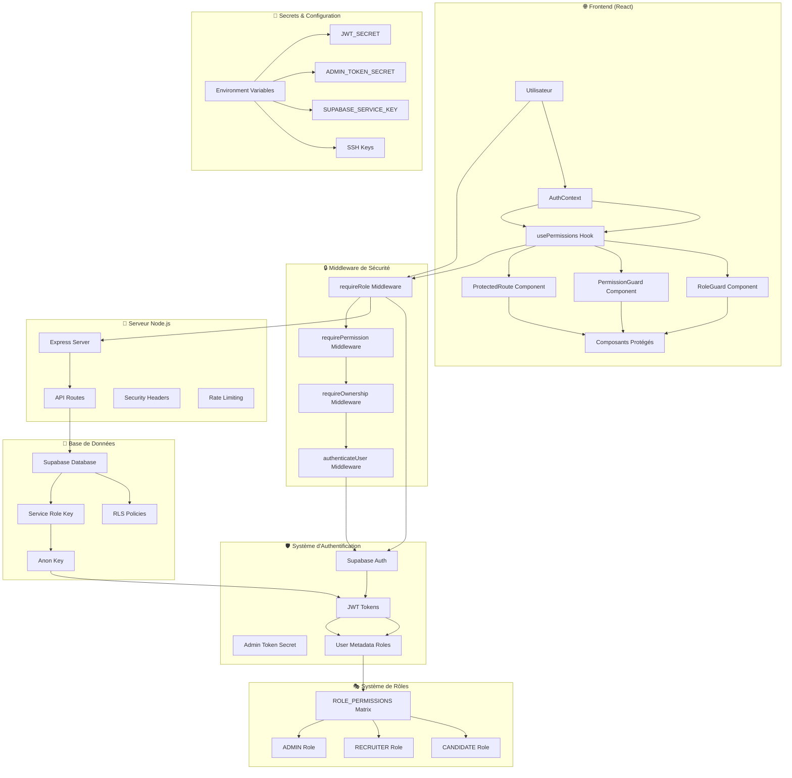
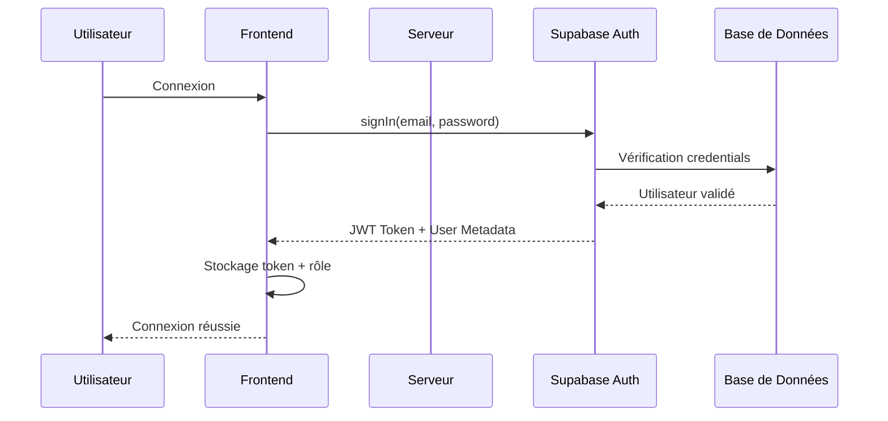
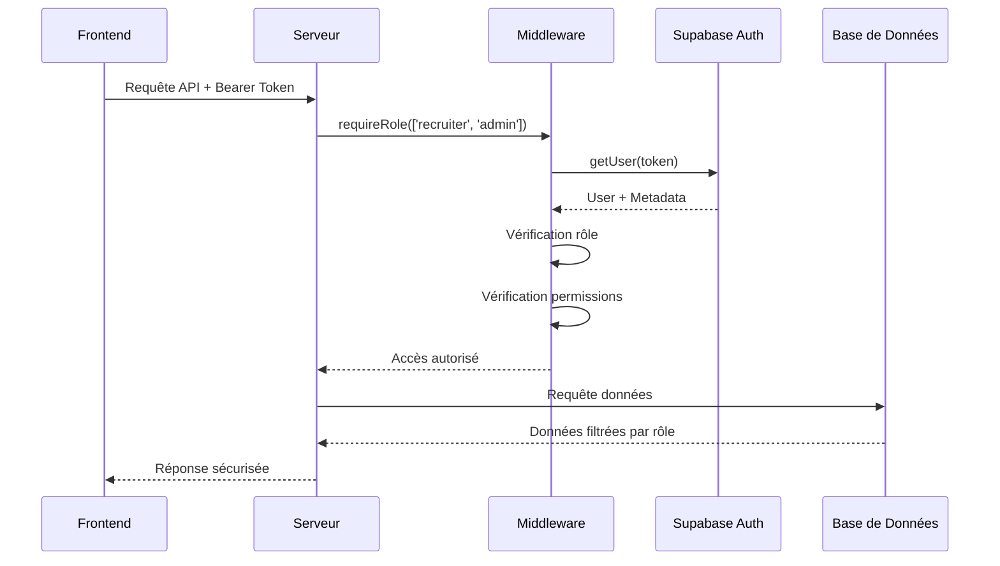

# 🔐 Architecture de Sécurité - UX Jobs Pro

## Vue d'ensemble de l'architecture de sécurité

## 🛡️ Couches de Sécurité

### 1. **Couche Frontend (React)**
- **AuthContext** : Gestion de l'état d'authentification
- **usePermissions Hook** : Vérification des permissions côté client
- **RoleGuard** : Protection des composants par rôle
- **PermissionGuard** : Protection des composants par permission
- **ProtectedRoute** : Protection des routes complètes

### 2. **Couche Middleware**
- **requireRole** : Vérification des rôles autorisés
- **requirePermission** : Vérification des permissions spécifiques
- **requireOwnership** : Vérification de la propriété des ressources
- **authenticateUser** : Authentification de base

### 3. **Couche Authentification**
- **Supabase Auth** : Service d'authentification principal
- **JWT Tokens** : Tokens d'authentification sécurisés
- **Admin Token Secret** : Token spécial pour les administrateurs
- **User Metadata** : Stockage des rôles dans les métadonnées

### 4. **Couche Base de Données**
- **Supabase Database** : Base de données PostgreSQL
- **RLS Policies** : Politiques de sécurité au niveau des lignes
- **Service Role Key** : Clé de service pour les opérations serveur
- **Anon Key** : Clé anonyme pour les opérations client

## 🎭 Système de Rôles et Permissions

### Rôles Disponibles
1. **CANDIDATE** : Utilisateurs créant leur profil
2. **RECRUITER** : Utilisateurs recherchant des candidats
3. **ADMIN** : Administrateurs avec accès complet

### Matrice des Permissions

| Permission | Candidat | Recruteur | Admin |
|------------|----------|-----------|-------|
| `view_own_profile` | ✅ | ❌ | ✅ |
| `edit_own_profile` | ✅ | ❌ | ✅ |
| `view_own_stats` | ✅ | ❌ | ✅ |
| `view_public_profiles` | ✅ | ✅ | ✅ |
| `view_all_candidates` | ❌ | ✅ | ✅ |
| `contact_candidates` | ❌ | ✅ | ✅ |
| `export_data` | ❌ | ✅ | ✅ |
| `view_all_profiles` | ❌ | ❌ | ✅ |
| `approve_profiles` | ❌ | ❌ | ✅ |
| `delete_profiles` | ❌ | ❌ | ✅ |
| `manage_users` | ❌ | ❌ | ✅ |
| `view_analytics` | ❌ | ❌ | ✅ |

## 🔐 Flux de Sécurité

### 1. **Authentification**

### 2. **Autorisation**

## 🛡️ Mesures de Sécurité Implémentées

### Côté Client
- ✅ **Protection des composants** : RoleGuard et PermissionGuard
- ✅ **Navigation conditionnelle** : Affichage selon le rôle
- ✅ **Hooks de permissions** : usePermissions pour vérifier les droits
- ✅ **Rendu conditionnel** : Affichage conditionnel du contenu
- ✅ **Routes protégées** : ProtectedRoute pour les pages sensibles

### Côté Serveur
- ✅ **Vérification des rôles** : Chaque requête API vérifie le rôle
- ✅ **Filtrage des données** : Données retournées selon le rôle
- ✅ **Token admin sécurisé** : Token spécial pour les administrateurs
- ✅ **Validation des permissions** : Middleware de vérification
- ✅ **Validation de propriété** : Vérification de l'ownership des ressources

### Base de Données
- ✅ **RLS Policies** : Politiques de sécurité au niveau des lignes
- ✅ **Clés séparées** : Service Role Key et Anon Key
- ✅ **Validation côté serveur** : Impossible de contourner les restrictions
- ✅ **Logs de sécurité** : Traçabilité des accès par rôle

## 🔑 Gestion des Secrets

### Secrets Obligatoires
- `VITE_SUPABASE_URL` : URL du projet Supabase
- `VITE_SUPABASE_ANON_KEY` : Clé anonyme Supabase
- `SUPABASE_SERVICE_KEY` : Clé de service Supabase
- `JWT_SECRET` : Secret pour signer les tokens JWT
- `ADMIN_TOKEN_SECRET` : Secret pour les tokens admin
- `DEPLOY_HOST` : IP/domaine du serveur
- `DEPLOY_USER` : Utilisateur SSH
- `DEPLOY_SSH_KEY` : Clé privée SSH
- `DEPLOY_PATH` : Chemin de déploiement

### Secrets Optionnels
- `PORT` : Port du serveur
- `DATABASE_URL` : URL de base de données
- `SENTRY_DSN` : DSN Sentry pour monitoring
- `LOG_LEVEL` : Niveau de log
- `SLACK_WEBHOOK_URL` : Webhook Slack
- `EMAIL_*` : Configuration email

## 🚨 Points d'Attention Sécurité

### Risques Identifiés
1. **Clé de service** : Utilisation de `supabaseAdmin` qui contourne RLS
2. **Token admin** : Token codé en dur (à sécuriser en production)
3. **Validation côté client** : Les permissions client sont uniquement pour l'UX

### Solutions Implémentées
1. **Validation stricte** : Vérification de l'ID utilisateur dans chaque fonction
2. **Middleware d'authentification** : Protection de toutes les routes
3. **Logs de sécurité** : Traçabilité des accès et tentatives d'intrusion

## 📊 Monitoring et Audit

### Logs de Sécurité
- ✅ Tentatives d'accès non autorisé
- ✅ Tokens invalides
- ✅ Changements de rôles
- ✅ Accès aux données sensibles

### Alertes Recommandées
- Tentatives d'accès avec des IDs différents
- Requêtes avec des tokens invalides
- Accès à des données non autorisées
- Volume anormal de requêtes

## 🔄 Évolutions Futures

### Améliorations Prévues
- [ ] Système de rôles hiérarchiques
- [ ] Permissions granulaires par ressource
- [ ] Audit trail complet des accès
- [ ] Interface d'administration des rôles
- [ ] Intégration avec des systèmes externes (LDAP, etc.)
- [ ] Rate limiting avancé
- [ ] Chiffrement des données sensibles
- [ ] Rotation automatique des clés

### Actions Immédiates
- [ ] Réviser toutes les fonctions utilisant `supabaseAdmin`
- [ ] Ajouter des validations de sécurité supplémentaires
- [ ] Tester les cas d'accès non autorisé
- [ ] Documenter toutes les permissions
- [ ] Mettre en place un monitoring de sécurité

---

**⚠️ IMPORTANT** : Cette architecture de sécurité doit être régulièrement audité et mise à jour pour maintenir un niveau de sécurité optimal.
